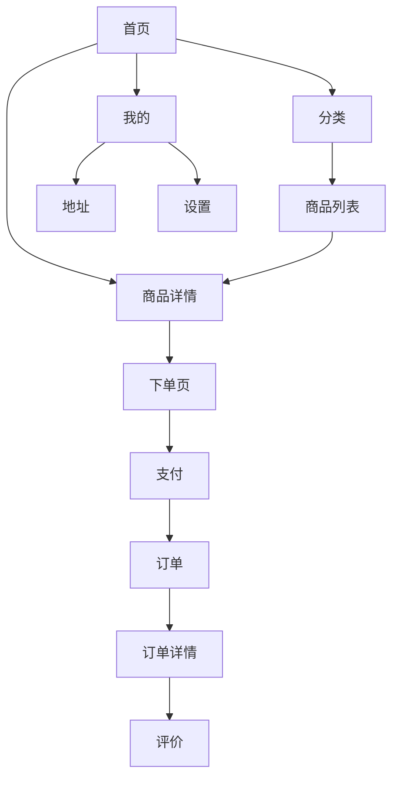

# 页面改造说明（对照 UI 高级参考标准）

## 1. 改造目标
- 统一：页面边距/字体/按钮/卡片/列表/反馈一致，降低学习成本。
- 提升：核心流程（选品→下单→支付→取衣→归还/评价）更清晰，减少误操作与“死胡同”。
- 保障：所有操作都有反馈；错误可恢复；列表与表单可用性达标（热区≥88rpx）。

## 2. 核心改造原则（落地为开发验收项）
1. 每页 1 个核心目标：删除干扰信息，把主 CTA 放在“视线末端、拇指可达”。
2. 统一布局：左右 20rpx；卡片间距 16rpx；列表项≥80rpx；按钮主 96rpx。
3. 反馈必达：>1s 显示加载；成功 toast；错误 modal/就地提示 + 解决方案；网络错误全屏重试。
4. 表单防丢：实时校验 + 错误紧贴字段；提交中 loading 防重复。
5. 页面栈≤5：跨多步流程优先“步骤页/确认页”，避免过深跳转。

## 3. 页面清单与改造点（按 frontend/app.json）

| 页面 | 主要模块 | 改造说明（只列必须项） |
|---|---|---|
| 首页（pages/index/index） | 顶部导航/入口区/商品推荐 | 用卡片网格呈现推荐；统一图片 1:1 + 16rpx 圆角；主行动按钮高度 96rpx；首屏加载骨架屏。 |
| 分类（pages/category/category） | 分类导航/商品列表 | 左侧分类与右侧列表点击热区≥88rpx；筛选控件优先选择器；空列表提供“去首页看看/清除筛选”。 |
| 订单（pages/order/order） | 当前订单摘要/快捷入口 | 用状态色区分（待支付灰、已支付蓝、已取衣绿、逾期红）；关键动作（支付/续租/联系客服）用主按钮。 |
| 我的（pages/profile/profile） | 用户信息/功能列表 | 列表项≥80rpx；分组标题使用辅助字体色；退出/注销等危险操作使用二次确认 modal。 |
| 套餐（pages/package/package） | 套餐列表/购买入口 | 套餐卡片统一：标题 H2、权益列表、价格强调；购买按钮固定在底部吸底（避开安全区）。 |
| 客服（pages/chat/chat） | 对话区/输入区 | 输入栏固定底部并适配安全区；发送中状态与失败重试；图片/订单卡片消息统一样式。 |
| 商品列表（pages/product/product） | 搜索/筛选/列表 | 搜索框高度对齐 80–96rpx；筛选为原生 picker；列表图懒加载；“库存紧张”标签用 Warning 色。 |
| 商品详情（pages/detail/detail） | 图集/规格/日期选择/CTA | 图集比例统一；规格选择用卡片式选择器；日期选择使用原生 picker（禁选已预订日期置灰+提示）；底部双按钮（收藏/下单）符合热区。 |
| 下单页（pages/orders/confirm） | 地址/租期/费用明细/提交 | 表单左对齐；费用明细分组卡片化；提交按钮未通过校验禁用（30% 透明度）；提交中 loading 防重复。 |
| 支付（pages/pay/pay） | 支付方式/确认支付 | 仅保留必要信息；支付状态有明确反馈；失败提供“重试/返回订单”。 |
| 预约（pages/appointment/appointment） | 日期选择/时间段/提交 | 使用原生 picker；不可选日期置灰并解释原因；提交后 toast + 跳转订单详情。 |
| 地址（pages/address/address） | 地址列表/新增编辑 | 列表项≥80rpx；新增编辑实时校验；支持定位能力优先（减少输入）。 |
| 订单列表（pages/orders/orders） | 筛选/列表 | 筛选与状态色统一；加载骨架/分页加载；空状态引导去首页/去分类。 |
| 订单详情（pages/order/detail/detail） | 状态时间线/明细/操作区 | 状态文字+图标组合；逾期展示倒计时与费用；主要操作单入口（避免同屏多个主按钮）。 |
| 评价（pages/review/review） | 星级/文字/图片 | 输入区提供占位示例；图片选择遵循图标规范；提交校验与防重复提交。 |
| 订阅（pages/subscribe/subscribe） | 订阅说明/授权 | 授权解释清晰可退出；拒绝授权后的替代路径（仍可浏览但提示功能受限）。 |
| 设置（pages/settings/settings） | 基础设置/关于 | 开关控件统一；危险操作（清缓存/退出）二次确认；版本信息使用提示文字样式。 |
| 店主端-订单（pages/admin/orders/orders） | 多条件筛选/批量操作 | 筛选条固定顶部；多选批量操作提供底部操作栏；退款/扣费为危险操作需二次确认。 |
| 店主端-订单详情（pages/admin/detail/detail） | 明细/状态操作/记录 | 操作区按优先级排序；所有状态变更必须有 toast + 可撤销（若业务允许）或明确提示。 |
| 店主端-套餐（pages/admin/package/package） | 套餐管理/编辑 | 表单实时校验；保存草稿避免丢失；保存成功后回列表并高亮更新项。 |

## 4. 导航与流程（页面关系图）

## 5. 视觉一致性检查清单（上线前必过）
- 边距：是否全站左右 20rpx、卡片间距 16rpx。
- 触达：所有可点元素热区是否≥88rpx。
- 字体：是否按 H1/H2/Body/Assist/Hint 分层；行高是否达标。
- 状态：是否无“死胡同”（空/错/断网都有出口）。
- 反馈：加载>1s 是否可见；提交是否防重复。
- 图标：是否仅用 24px/32px、2px 线宽、无渐变。
