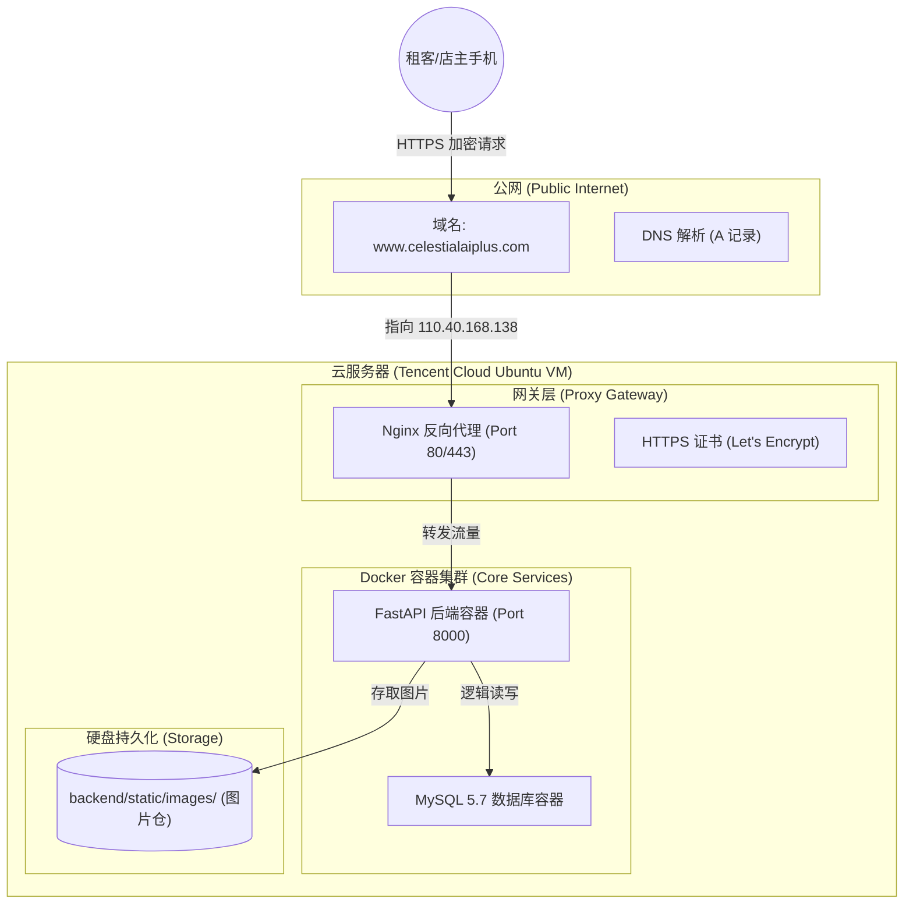

# 小时光租衣舍：生产环境部署全纪实 (Deployment Diary)

本项目记录了“小时光租衣舍”小程序从原始的“微信云开发”剥离，并成功部署到独立 Ubuntu 服务器的完整路径。这份文档是系统稳定运行、未来扩容和新人交接的核心资产。

---

## 🏗️ 系统整体架构可视化 (Full Architecture)

下面的架构图展示了从用户手机点击到服务器数据返回的完整请求链路：


下面是租客 / 店主业务流程图：

```mermaid
graph LR
    classDef user fill:#e3f2fd,stroke:#2196f3,stroke-width:2px
    classDef shop fill:#fff3e0,stroke:#ff9800,stroke-width:2px
    classDef sys fill:#f1f8e9,stroke:#4caf50,stroke-dasharray: 5 5
    classDef gold fill:#fff9c4,stroke:#fbc02d,stroke-width:2px

    subgraph "👤 租客环节 (User Session)"
        U1[浏览高奢画册]:::user --> U2{选择档期/日历}
        U2 -- 有货 --> U3[提交订单/套餐]
        U2 -- 档期已满 --> U1
        U3 --> U4[支付: 租金+押金]:::gold
    end

    subgraph "⚙️ 系统自动化 (Logic & DB)"
        S1[后端校验库存]:::sys --> S2[锁定日期/占用]
        S2 --> S3[生成合同单]
        S3 --> S4[实时推送通知]
    end

    subgraph "🧑‍💼 店主环节 (Merchant Operations)"
        M1[后台收到新单]:::shop --> M2[扫码/发货]
        M2 --> M3[实时追踪租赁倒计时]
        M3 --> M4{检查衣物/还衣}
        M4 -- 确认无损 --> M5[一键退还押金]:::gold
        M4 -- 等待超期扣费 --> M3
    end

    %% 关联关系
    U4 -- 成功触发 --> S1
    S4 -- 提醒店主 --> M1
    M5 -- 资金原路返回 --> U1
    M2 -- 更改状态 --> S3
```



---

## ⚠️ 核心背景：为何“弃暗投明”？

本系统在初期测试阶段曾重度依赖「微信云托管」，但最终因以下**“血泪教训”**果断转型：
- **故障原由**：微信云托管与 Serverless 数据库（CynosDB）之间存在隐形的 VPC 网络隔离。当数据库进入休眠再冷启动时，后端容器会爆发 `OperationalError: 2003 Timeout` 锁死错误。
- **最终对策**：回归工业级主流方案 —— **私有化 Ubuntu 22.04 + Docker Compose**。通过物理上的同一网段彻底消除延迟与隔离。

---

## 🚀 从技术到商业：0 到 1 部署全链路映射

下面的流程图展示了本项目从一行代码到正式商业运营的必经之路，以及关键的核心步骤与要点：

```text
【开发阶段】          【部署阶段】                 【合规阶段】            【准入阶段】          【运营阶段】
  GitHub -----------→ 云服务器 (Docker) --------→ ICP 备案 (工信部) ----→ 小程序备案(微信)-----→ 商户号 (微信)
    |                      |                         |                      |                    |
    ↓                      ↓                         ↓                      ↓                    ↓
 ✅1. GitHub 源码同步  ✅1. Docker 容器构建    1. 工信部ICP备案      ✅1. 微信小程序备案     1. 营业执照资质
 ✅2. env 环境切换     ✅2. 数据库初始化       2. 域名实名认证          2. 服务类目审核       2. 微信支付商户号
 ✅3. 本地联调测试     ✅3. Nginx 反向代理   ✅3. HTTPS 证书配置     ✅3. 域名白名单绑定     3. 支付接口配置
 ✅4. 代码规范检查     ✅4. 防火墙开放         4. 公安联网备案          4. 接口权限校验       4. 体验版/正式发布
 ✅5. 真机预览调试                             5. 主体资质核验          5. 合规内容检查       5. 版本迭代更新
```
---

## 📝 0 到 1 详细指南 (商业级避坑版)

### 第一阶段：服务器 (基础设施)
*   **目的**：在公网上租用一台属于自己的“ 24 小时永不关机”的电脑。
*   **动作**：
    1.  **购置资源**：前往 [腾讯云轻量控制台](https://console.cloud.tencent.com/lighthouse)，购买 Ubuntu 22.04 实例。
    2.  **防火墙开门**：在控制台点击 **“防火墙”** -> **“添加规则”**。
        *   放行 `22`(SSH 登录), `80/443`(HTTPS 门户), `8000`(后端 API), `81`(管理面板)。
*   **避坑指南**：很多新人改了 Nginx 却连不通，通常是因为**没在云控制台页面**开 443 端口，只在系统内开了是不行的。

### 第二阶段：数据库
*   **目的**：确保你的衣服名称、租金、描述中的中文和 Emoji 能被正确存储，而不变成乱码。
*   **动作**：
    1.  **启动环境**：在项目根目录执行 `docker compose up -d`。
    2.  **精准导入**：进入 MySQL 容器导入数据时，**必须先声明编码**：
        ```bash
        docker exec -it time-capsule-db mysql -u root -p
        mysql> SET NAMES utf8mb4;  # 核心动作：支持四字节字符（如 Emoji）
        mysql> source /app/backup.sql;
        ```
*   **相关网址**：[MySQL 官方文档](https://dev.mysql.com/doc/refman/5.7/en/)。

### 第三阶段：域名
*   **目的**：获取中国互联网的“准入证”。在大陆机房，不备案域名就无法使用 443 端口。
*   **动作**：
    1.  **DNS 设置**：前往 [DNSPod (腾讯云 DNS)](https://console.cloud.tencent.com/cns) 添加 A 记录指向服务器 IP。
    2.  **ICP 备案**：前往 [腾讯云备案系统](https://console.cloud.tencent.com/beian) 或微信小程序 **「腾讯云办备案」** 提交申请。
*   **避坑指南**：一旦发现域名解析到大陆 IP 且未备案，运营商会触发 `PR_END_OF_FILE_ERROR` 硬件阻断。开发阶段请勾选微信 IDE 的 **“不校验域名”** 并直接使用 `http://IP:8000` 绕行。

### 第四阶段：网关加锁 (HTTPS 闭环)
*   **目的**：满足微信“非 HTTPS 不通”的安全强制要求，给数据传输穿上防弹衣。
*   **动作**：
    1.  **Nginx 配置**：确保 `/etc/nginx/sites-enabled/api` 文件的 `server_name` 正确指向你的域名。
    2.  **获取证书**：使用 [Certbot](https://certbot.eff.org/) 一键获取免费证书。
        ```bash
        sudo certbot --nginx -d www.celestialaiplus.com
        ```
*   **官网入口**：[Let's Encrypt 官网](https://letsencrypt.org/)。

### 第五阶段：商业转身 (支付与资质)
*   **目的**：从小程序“个人玩玩”升级成“真实收钱”的店铺。
*   **动作**：
    1.  **主体升级**：前往 [微信公众平台](https://mp.weixin.qq.com)，认证为主体为“个体户”或“企业”。
    2.  **开通支付**：前往 [微信支付商户平台](https://pay.weixin.qq.com) 关联小程序 AppID。
    3.  **公安备案**：ICP 备案通过 30 天内，去 [全国互联网安全管理平台](http://www.beian.gov.cn/) 做最后的补充登记。
*   **核心限制**：**个人主体小程序不支持“租赁”类目**，也无法直接调用支付接口。若要真收钱，必须办营业执照。
---
MIT License © *2026 04* · 小时光租衣舍 007/100
