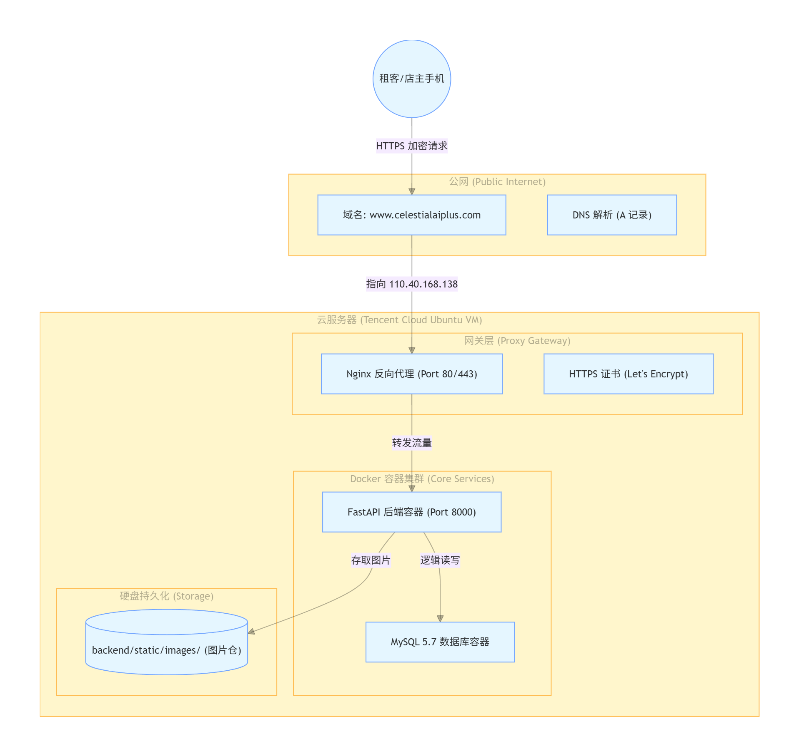
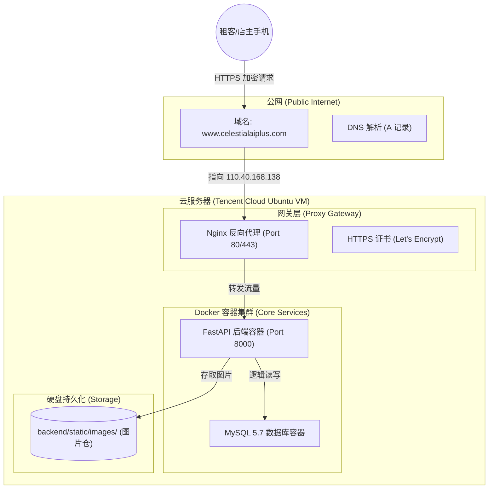
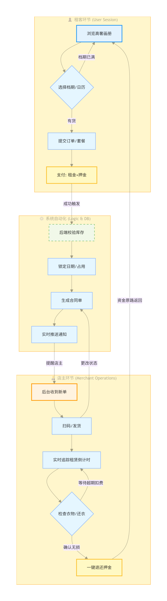

# 小时光租衣舍：生产环境部署全纪实 (Deployment Diary)

本项目记录了“小时光租衣舍”小程序从原始的“微信云开发”剥离，并成功部署到独立 Ubuntu 服务器的完整路径。这份文档是系统稳定运行、未来扩容和新人交接的核心资产。

---

## 🏗️ 系统整体架构可视化 (Full Architecture)

下面的架构图展示了从用户手机点击到服务器数据返回的完整请求链路：


下面是租客 / 店主业务流程图：

```mermaid
graph LR
    classDef user fill:#e3f2fd,stroke:#2196f3,stroke-width:2px
    classDef shop fill:#fff3e0,stroke:#ff9800,stroke-width:2px
    classDef sys fill:#f1f8e9,stroke:#4caf50,stroke-dasharray: 5 5
    classDef gold fill:#fff9c4,stroke:#fbc02d,stroke-width:2px

    subgraph "👤 租客环节 (User Session)"
        U1[浏览高奢画册]:::user --> U2{选择档期/日历}
        U2 -- 有货 --> U3[提交订单/套餐]
        U2 -- 档期已满 --> U1
        U3 --> U4[支付: 租金+押金]:::gold
    end

    subgraph "⚙️ 系统自动化 (Logic & DB)"
        S1[后端校验库存]:::sys --> S2[锁定日期/占用]
        S2 --> S3[生成合同单]
        S3 --> S4[实时推送通知]
    end

    subgraph "🧑‍💼 店主环节 (Merchant Operations)"
        M1[后台收到新单]:::shop --> M2[扫码/发货]
        M2 --> M3[实时追踪租赁倒计时]
        M3 --> M4{检查衣物/还衣}
        M4 -- 确认无损 --> M5[一键退还押金]:::gold
        M4 -- 等待超期扣费 --> M3
    end

    %% 关联关系
    U4 -- 成功触发 --> S1
    S4 -- 提醒店主 --> M1
    M5 -- 资金原路返回 --> U1
    M2 -- 更改状态 --> S3
```



---

## ⚠️ 核心背景：为何“弃暗投明”？

本系统在初期测试阶段曾重度依赖「微信云托管」，但最终因以下**“血泪教训”**果断转型：
- **故障原由**：微信云托管与 Serverless 数据库（CynosDB）之间存在隐形的 VPC 网络隔离。当数据库进入休眠再冷启动时，后端容器会爆发 `OperationalError: 2003 Timeout` 锁死错误。
- **最终对策**：回归工业级主流方案 —— **私有化 Ubuntu 22.04 + Docker Compose**。通过物理上的同一网段彻底消除延迟与隔离。

---

## 🚀 0 到 1 部署实战清单

### 第一步：地基整备（服务器与 DNS）
1. **购置服务器**：购买腾讯云轻量应用服务器（Ubuntu 22.04），并放行 `22`, `80`, `443`, `8000`, `81` 端口。
2. **域名解析**：在 DNSPod 中将 `@` 和 `www` 两个 A 记录指向服务器 IP `110.40.168.138`。
3. **连通验证**：关闭本地代理后用 `ping` 命令确认域名已正确指向目标 IP。

### 第二步：Docker 环境与加速配置
若拉取镜像缓慢或 `apt` 进度卡死，务必配置国内源加速：
```bash
# 安装 Docker 工具集
sudo apt update && sudo apt install -y docker.io docker-compose-v2

# 配置国内镜像源缓解同步超时
sudo tee /etc/docker/daemon.json <<-'EOF'
{ "registry-mirrors": ["https://mirror.ccs.tencentyun.com", "https://hub-mirror.c.163.com"] }
EOF
sudo systemctl restart docker
```

### 第三步：应用上线与数据注入
通过 `docker-compose.yml` 联合启动 backend 和 mysql：
```bash
cd ~/wechatAPP
docker compose up -d --build
```
**🚨 防坑重点（字符集乱码）：** 导入初始 SQL 脚本前，必须在 MySQL 终端执行 `SET NAMES utf8mb4;`，否则中文描述会变成不可读乱码。

### 第四步：网关加锁（Nginx & HTTPS）
由于微信强制要求 `https://` 且不能带端口号：
1. **反向代理**：配置 Nginx 监听 80，并将 `celestialaiplus.com` 的流量分派给 `127.0.0.1:8000`。
2. **自动化 SSL**：
   ```bash
   apt install certbot python3-certbot-nginx
   certbot --nginx -d www.celestialaiplus.com
   ```
3. **准入同步**：在微信公众平台将该 HTTPS 域名加入 `request 合法域名` 列表。

---

## 🔄 日常热修补与维护规范

### 1. 代码一键热更新
当你修改了代码并推送到 GitHub 后，去服务器执行这三行：
```bash
cd ~/wechatAPP
git pull origin test
docker compose up -d --build # 容器会自动重启并应用新代码
```

### 2. 数据库图片链接热修正
如果由于域名更换导致历史图片的链接变黑，请进数据库执行批量替换：
```sql
UPDATE products 
SET cover_image = REPLACE(cover_image, '旧域名/地址', 'https://www.celestialaiplus.com/static/images/');
```

### 3. 前后端更新边界 (💡)
- **改界面/按钮**：本地上传小程序代码即可，**不要动服务器**。
- **改接口/数据库**：必须操作服务器执行 Git Pull 与 Docker 重建。

---
MIT License © *2026 04* · 小时光租衣舍 007/100
